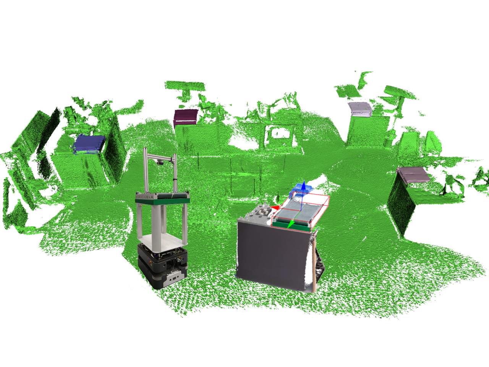

# Efficient Object-Level Semantic Mapping with RGB-D Cameras

**Related Paper:**  

+ Benchun Zhou, et al. **Efficient Object-Level Semantic Mapping with RGB-D Cameras**[C]//2023 Under Submission. [[**Link**]()] [[**PDF**](./README_Picture/2023_Autonomous_Robots_Publication.pdf)] [[**Slide**](./README_Picture/2023_Autonomous_Robots_Slide.pdf)] [[**Youtube**](https://youtu.be/e10FkwQ8WiA)] [[**Bilibili**](https://www.bilibili.com/video/BV1dg4y1s7Nh)]

+ If you use the code in your academic work, please cite the above paper. 

<div align=center></div>

## 1. Prerequisites 
* Ubuntu (18.04.5)
* CMake (3.10.2)
* Eigen (3)
* OpenCV (3.2.0)
* PCL (1.8.1)
* Note: the code builds on the top of [**voxblox++**](https://github.com/ethz-asl/voxblox-plusplus), if you meet compile problems, please refer to [**voxblox++**](https://github.com/ethz-asl/voxblox-plusplus).

## 2. Framework
The proposed object-level semantic mapping takes RGB-D sequences as input and incrementally builds a volumetric map enriched with object instances. To achieve these functions, the RGB-D sequences are initially processed by a camera pose tracking framework. Then, an object instance segmentation method is employed to detect and extract semantic 3D objects from a single frame. After that, these frame-based detected objects are matched to globally mapped objects via an object association strategy, which uses geometric and semantic descriptors to track and update objects across multiple frames. Finally, the associated objects are incorporated into a TSDF volumetric mapping framework to generate an object-level dense map.

<div align=center></div>

## 3. Running
firstly, we need to use the mapping and visulization tools from [**voxblox++**](https://github.com/ethz-asl/voxblox-plusplus), try to download and compile it. since we have our own object detection method, we do not need to compile mask-rcnn. 

### Install voxblox++
In your terminal, define the installed ROS version and name of the catkin workspace to use:
```
    export ROS_VERSION=melodic # (Ubuntu 16.04: kinetic, Ubuntu 18.04: melodic)
    export CATKIN_WS=~/catkin_ws
```
If you don't have a catkin workspace yet, create a new one:
```
    mkdir -p $CATKIN_WS/src && cd $CATKIN_WS
    catkin init
    catkin config --extend /opt/ros/$ROS_VERSION --merge-devel 
    catkin config --cmake-args -DCMAKE_CXX_STANDARD=14 -DCMAKE_BUILD_TYPE=Release
    wstool init src
```
Clone the voxblox_plusplus repository over HTTPS (no Github account required) and automatically fetch dependencies:
```
    cd $CATKIN_WS/src
    git clone --recurse-submodules https://github.com/ethz-asl/voxblox-plusplus.git
    wstool merge -t . voxblox-plusplus/voxblox-plusplus_https.rosinstall
    wstool update
```
Alternatively, clone over SSH (Github account required):
```
    cd $CATKIN_WS/src
    git clone --recurse-submodules git@github.com:ethz-asl/voxblox-plusplus.git
    wstool merge -t . voxblox-plusplus/voxblox-plusplus_ssh.rosinstall
    wstool update
```
Clone our own object segmentation packges:
```
    cd $CATKIN_WS/src
    git clone https://github.com/benchun123/object-level-mapping.git
```
Build and source the object-segmentation and voxblox++ packages:
```
    catkin build gsm_node object_segmentation
    source ../devel/setup.bash
```
Download dataset: 

the open-source code runs on a [AgiProbot rosbag](https://bwsyncandshare.kit.edu/s/6bpEasr5wj29RAA). More info for data process can be found [here](https://bwsyncandshare.kit.edu/s/4fsZmNnEAPL8FKH)

Run it as follows:
terminal 1: -> launch object segmentation node, convert rgbd to point cloud
```
    roslaunch object_segmentation debug.launch 
```
terminal 2: -> launch voxblox_plusplus node, configuration is in agiprobot.yaml
```
    roslaunch object_segmentation voxblox_plusplus.launch 
```
terminal 3: -> play rosbag
```
    rosbag play /home/benchun/dataset/agiprobot/agiprobot_3.bag 
```

## 4. Note 
### 4.1 TF tree: two timestamp: 
1) one from the vehicle: map -> odom -> base_link -> laser
2) one from the camera: camera_body -> rgb / depth_link
3) trick 1: manually set transform from camera and base_link, directly convert point cloud from camera_link to base_link.
4) trick 2: since voxblox++ focus on timestamp, so, we listner transform from base_link to odom and attach current odom timestamp to point cloud 


### 4.2 agiprobot.yaml: configuration
the point cloud are defined as three different type: 
see controller.cpp: 
```
    voxblox::PointSemanticInstanceType (xyz, rgb, semantic, instance)
    voxblox::PointLabelType (xyz, rgb, label)
    voxblox::PointType (xyz, rgb)
```
to select the point type:
```
    "semantic_instance_segmentation/enable_semantic_instance_segmentation": false
    "use_label_propagation": true
```
the code also add PCL::PointType, see PointSurfelSemanticInstance in common.h

trick: if we need to build the global map, choose general point type, if we just use object, choose pointLabel type. when to use semanticInstance type?


### 4.3 visualier
the visualier is based on PCL::Visualier to visualize mesh: mesh_merged_layer_
```
enable "meshing/visualize: true" to show mesh in PCL::Visualier
enable "publishers/publish_scene_mesh: true" to publish voxblox_mesh in rviz
```

### 4.4 integrater
std::shared_ptr<LabelTsdfIntegrator> integrator_;
in fact it is based on labelTsdf. 
process: 
1) point cloud call back
2) check integrated frame -> merge point cloud
3) process segmented point cloud -> convert point to segments with 1/3 VoxbloxPointType 
4) choose one VoxbloxPointType and update

### 4.5 Others
1) when connect to voxblox++, we use label information, where the point cloud type is pcl::PointCloud<pcl::PointXYZRGBL>. 
2) when publish, we should publish the segmentation with only one label every time, not the whole point cloud with different labels. 
3) currently, we just need to publish object pcl in base_link, just local info, not global, we do not do object association and updating. 
4) since the wheel odom from agiprobot bag is not good, we create a new tf from odom to new_base_link, it works better. we do not publish it in odom frame, which does not work for voxblox++


## 5. Acknowledgement 

Thanks for the great work:  [**voxblox**](https://github.com/ethz-asl/voxblox.git), [**voxblox++**](https://github.com/ethz-asl/voxblox-plusplus.git), and [**yolo**](https://github.com/leggedrobotics/darknet_ros.git)

+ Margarita Grinvald, Fadri Furrer, Tonci Novkovic, Jen Jen Chung, Cesar Cadena, Roland Siegwart, and Juan Nieto, **Volumetric Instance-Aware Semantic Mapping and 3D Object Discovery**, in _IEEE Robotics and Automation Letters_, July 2019. [[PDF](https://arxiv.org/abs/1903.00268)] [[Video](https://www.youtube.com/watch?v=Jvl42VJmYxg)]

```bibtex
@article{grinvald2019volumetric,
  author={M. {Grinvald} and F. {Furrer} and T. {Novkovic} and J. J. {Chung} and C. {Cadena} and R. {Siegwart} and J. {Nieto}},
  journal={IEEE Robotics and Automation Letters},
  title={{Volumetric Instance-Aware Semantic Mapping and 3D Object Discovery}},
  year={2019},
  volume={4},
  number={3},
  pages={3037-3044},
  doi={10.1109/LRA.2019.2923960},
  ISSN={2377-3766},
  month={July},
}
```
+ Helen Oleynikova, Zachary Taylor, Marius Fehr, Juan Nieto, and Roland Siegwart, “**Voxblox: Incremental 3D Euclidean Signed Distance Fields for On-Board MAV Planning**”, in *IEEE/RSJ International Conference on Intelligent Robots and Systems (IROS)*, 2017.

```bibtex
@inproceedings{oleynikova2017voxblox,
  author={Oleynikova, Helen and Taylor, Zachary and Fehr, Marius and Siegwart, Roland and  Nieto, Juan},
  booktitle={IEEE/RSJ International Conference on Intelligent Robots and Systems (IROS)},
  title={Voxblox: Incremental 3D Euclidean Signed Distance Fields for On-Board MAV Planning},
  year={2017}
}
```
